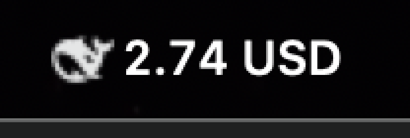

# 🐋 DeepSeek Balance Monitor — [Download v1.0](https://github.com/thmssm/deepseek-balance-monitor/releases/latest)

### For the $2 top-up gang

You know who you are. You top up **$2 worth of DeepSeek credits** because "that's all you need for today." Then your agent starts writing code, and suddenly you're watching that balance tick down like a fuel gauge in a '97 Civic that's already on E.

This little menu bar app sits in your macOS top bar and **shows your remaining DeepSeek balance at all times**. No more refreshing the billing page. No more "did my $2 run out yet?" panic. Just a beautiful whale icon and a number that slowly, inexorably, decreases.

**Turns red when you're under $1.** You know, the danger zone.




---

### Features

- 🐋 **Sits in your menu bar** — always visible, always judging your spending habits
- 🔴 **Red text when < $1** — so you can feel the urgency
- ⏱ **Refreshes every 60 seconds** — obsessive but not unhinged
- 🌓 **Follows macOS dark/light mode** — because even your anxiety should look good
- 🚀 **Click "Top Up →"** — goes straight to the billing page, zero friction to feed the addiction
- **No Dock icon** — it lives in the shadows, like your credit card debt

---

### Download

**[⬇ Download DeepSeek Balance v1.0](https://github.com/thmssm/deepseek-balance-monitor/releases/latest)** — 22 KB, no dependencies, ready to run.

1. Download and unzip
2. Move `DeepSeekBalance.app` to your Applications folder
3. Right-click → Open (it's unsigned, macOS will complain — override it)
4. Set your API key (see below)
5. Done. It's in your menu bar.

---

### How to Install (manual build)

Prefer to build from source? Clutch those pearls.

```bash
git clone https://github.com/thmssm/deepseek-balance-monitor
cd deepseek-balance-monitor
./build.sh
open DeepSeekBalance.app
```

That's it. One `swiftc` call, no dependencies, no npm, no Cargo, no pod install, no Docker, no "but first install Rust."

*(If you don't have `rsvg-convert`, the build script skips the icon step. Or just `brew install librsvg` and rebuild.)*

#### Set your API key

The app looks for your DeepSeek API key in one of two places:

**Option A — Environment variable (recommended):**
```bash
export DEEPSEEK_API_KEY="sk-you...here"
```
Add it to your `~/.zshrc` or launchd plist if you want it permanent.

**Option B — Key file:**
```bash
echo "sk-you...here" > ~/.deepseek-api-key
chmod 600 ~/.deepseek-api-key
```

#### Auto-start at login (optional)

```bash
mkdir -p ~/Library/LaunchAgents
cat > ~/Library/LaunchAgents/com.deepseek.balance-monitor.plist <<'PLIST'
<?xml version="1.0" encoding="UTF-8"?>
<!DOCTYPE plist PUBLIC "-//Apple//DTD PLIST 1.0//EN" "http://www.apple.com/DTDs/PropertyList-1.0.dtd">
<plist version="1.0">
<dict>
    <key>Label</key>
    <string>com.deepseek.balance-monitor</string>
    <key>ProgramArguments</key>
    <array>
        <string>/Applications/DeepSeekBalance.app/Contents/MacOS/DeepSeekBalance</string>
    </array>
    <key>RunAtLoad</key>
    <true/>
    <key>KeepAlive</key>
    <true/>
    <key>EnvironmentVariables</key>
    <dict>
        <key>DEEPSEEK_API_KEY</key>
        <string>sk-you...here</string>
    </dict>
</dict>
</plist>
PLIST
launchctl load ~/Library/LaunchAgents/com.deepseek.balance-monitor.plist
```

---

### How it works

90 lines of Swift, one `URLSession` call every 60 seconds, a template PNG of the DeepSeek whale, and zero external dependencies. It's the smallest piece of software you've ever installed that will still make you anxious.

---

### FAQ

**Q: Why?**  
A: Because checking the DeepSeek billing page manually is too much work for my ADHD brain.

**Q: Will this drain my battery?**  
A: It's one HTTP request per minute. Your charger cable is fine.

**Q: Can I change the refresh rate?**  
A: Edit `refreshInterval` at the top of `main.swift` and rebuild. Don't set it below 10 seconds or the DeepSeek API will personally call you.

**Q: It shows "--"**  
A: Your API key is wrong, or DeepSeek is having a moment. Check your `DEEPSEEK_API_KEY`.

**Q: The whale looks squished.**  
A: No it doesn't. I spent way too long on that icon.

**Q: Why is the app unsigned?**  
A: Because Apple charges $99/year to tell people your app isn't a virus. It's a 22 KB menu bar icon. If you're worried, build from source — it's 90 lines of Swift.

---

### License

MIT. Do whatever you want. If you lose all your DeepSeek credits while staring at the menu bar, that's on you.
